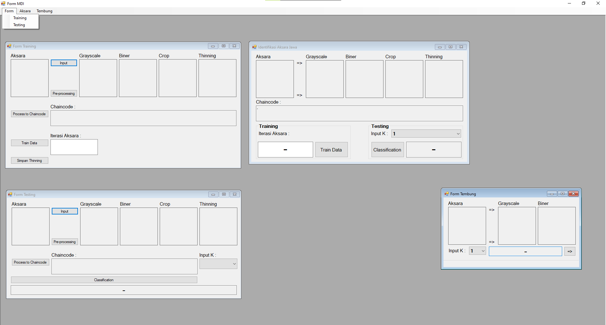

# Identifikasi Aksara Jawa
**Javanese Alphabet Identification**

*`An application system that can recognize handwritten Javanese characters based on shape characteristics by applying the Chain Code and K-Nearest Neighbor methods.`*

Screenshost
--------------------------------------------------------------------------------

